# Design

## Approach

**Direct Port + pi Adaptations** — Faithfully port all 10 stages, 55 agent types, and the full orchestrator prompt from the proven opencode deepwork pipeline. Adapt only what is strictly necessary for pi's API differences: `Agent` tool dispatch (replaces opencode `task`), `qrspi_question` tool (replaces opencode `question`), and telemetry simplification. All pipeline stages, return contracts, state protocols, route logic, backward loops, human gates, and git checkpoints are preserved verbatim.

**Rationale**: The opencode deepwork pipeline is a battle-tested, multi-stage agent orchestration system with 55 specialized subagents, proven over many runs. Rewriting or re-architecting risks breaking subtle interactions (goal-blind research constraint, fast-impl-loop invariants, backward-loop-detector priority ordering, unclean-cap escalation gates). The two rejected alternatives — *Core Stages First* (incomplete pipeline; quick-fix/backward-loop paths broken until late) and *pi-Native Rearchitecture* (diverges from proven pipeline, fails to preserve all 10 stages required by goals) — each introduce risk of missing acceptance criteria 1, 3, 4, and 6.

## Architectural Patterns

- **Follow**: File-based pipeline state protocol — state is a stage-boundary-only checkpoint (`state.md`); mid-stage interruption restarts that stage from its beginning. All artifacts live under `.pipeline/qrspi-<run-id>/`. Source: `deepwork.md:108`, `deepwork.md:319-340`.
- **Follow**: Foreground blocking subagent dispatch — stage orchestrators run sequentially; leaf subagents dispatched by orchestrators complete before the orchestrator proceeds. This maintains deterministic pipeline flow. Source: `deepwork.md:70-99`.
- **Follow**: pi extension factory-function lifecycle — extensions export a default factory function `export default function(pi: ExtensionAPI)`; commands and tools registered via `pi.registerCommand()` and `pi.registerTool()`; skills injected via `resources_discover` event. Source: pi extensions docs, `extensions.md`.
- **Follow**: Custom tool bypass pattern — `qrspi_dispatch` tool accesses `Symbol.for("pi-subagents:manager")` to spawn sub-subagents, bypassing the `Agent` tool block that applies to subagents. Source: `pi-subagents/index.ts:431-440`.
- **Follow**: YAML frontmatter agent type convention — agent types are `.md` files with `description`, `tools`, `model`, `thinking`, `max_turns`, `prompt_mode`, `extensions` fields in frontmatter. Source: `custom-agents.ts:70-87`, `types.ts:35-79`.
- **Avoid**: Horizontal layer decomposition — do not organize work as "database layer → API layer → UI layer." Every slice delivers end-to-end pipeline behavior (orchestrator → leaf agents → artifacts → state transition).
- **Avoid**: Permission system porting — opencode's granular permission model does not exist in pi. Tool permissions are approximated via `tools` / `disallowed_tools` frontmatter fields; the orchestrator trusts stage subagents to honor their contracts. Do not attempt to replicate opencode's allowed-list cross-check.

## System Diagram

```mermaid
flowchart TB
    subgraph User["User"]
        UC["/deepwork 'task'<br>/deepwork-resume &lt;id&gt;"]
    end

    subgraph Extension["deepwork-pi Extension (src/index.ts)"]
        CMD["Command Handler"]
        TOOLS["qrspi_dispatch tool<br>qrspi_question tool"]
        SKILL["deepwork skill<br>(skills/deepwork/SKILL.md)"]
    end

    subgraph Pipeline["Pipeline Helpers (src/pipeline.ts)"]
        RID["generateRunId()"]
        DIR["getPipelineDir()"]
        STATE["state.md templates"]
    end

    subgraph PiRuntime["pi Runtime"]
        API["ExtensionAPI<br>registerCommand / registerTool"]
        UI["ctx.ui<br>confirm / select"]
        EVENTS["resources_discover"]
    end

    subgraph PiSubagents["@tintinweb/pi-subagents"]
        AGENT["Agent tool"]
        AM["AgentManager<br>spawn / spawnAndWait"]
        SYM["Symbol.for('pi-subagents:manager')"]
    end

    subgraph Orchestrator["Main pi Agent (Orchestrator)"]
        OSKILL["deepwork skill injected"]
        ORCH["Pipeline orchestration loop:<br>dispatch stage → parse return →<br>write state → telemetry → git"]
    end

    subgraph StageAgents["Stage Orchestrator Subagents (11 total)"]
        S1["qrspi-goals<br>(Stage 1)"]
        S2["qrspi-questions<br>(Stage 2)"]
        S3["qrspi-research<br>(Stage 3)"]
        S4["qrspi-design<br>(Stage 4)"]
        S5["qrspi-structure<br>(Stage 5)"]
        S6["qrspi-plan<br>(Stage 6)"]
        S7["qrspi-implement<br>(Stage 7)"]
        S8["qrspi-accept<br>(Stage 8)"]
        S85["qrspi-replan<br>(Stage 8.5)"]
        S9["qrspi-verify<br>(Stage 9)"]
        S10["qrspi-report<br>(Stage 10)"]
    end

    subgraph LeafAgents["Leaf Subagents (44 total)"]
        LSYNTH["synthesizers / writers<br>(6 agents)"]
        LREVIEW["reviewers<br>(14 agents)"]
        LRESEARCH["researchers<br>(6 agents)"]
        LCODE["code writers / testers<br>(5 agents)"]
        LLOOP["loop / verification<br>(5 agents)"]
        LCHECK["checkers + detector<br>(5 agents)"]
        LCODEREV["code review lenses<br>(4 agents)"]
    end

    subgraph FileSystem[".pipeline/qrspi-&lt;run-id&gt;/"]
        SM["state.md"]
        ARTIFACTS["goals.md, questions.md,<br>research/summary.md, design.md,<br>structure.md, plan.md,<br>phases/phase-NN/,<br>reviews/, baseline/"]
        TELEM["telemetry/events.jsonl<br>telemetry/run-log.md<br>telemetry/metrics-summary.md"]
    end

    subgraph Git["Git"]
        BRANCH["qrspi/&lt;run-id&gt; branch"]
        COMMITS["stage-boundary commits"]
    end

    UC -->|slash command| CMD
    CMD --> RID
    CMD --> DIR
    CMD --> STATE
    CMD -->|registerCommand| API
    TOOLS -->|registerTool| API
    SKILL -->|inject via| EVENTS
    CMD -->|injects skill → kickoff| ORCH

    ORCH -->|Agent tool| AGENT
    AGENT -->|spawn foreground| AM
    AM --> SYM
    AGENT -->|dispatch| S1
    AGENT -->|dispatch| S2
    AGENT -->|dispatch| S3
    AGENT -->|dispatch| S4
    AGENT -->|dispatch| S5
    AGENT -->|dispatch| S6
    AGENT -->|dispatch| S7
    AGENT -->|dispatch| S8
    AGENT -->|dispatch| S85
    AGENT -->|dispatch| S9
    AGENT -->|dispatch| S10

    S1 -->|qrspi_dispatch| LSYNTH
    S1 -->|qrspi_dispatch| LREVIEW
    S2 -->|qrspi_dispatch| LRESEARCH
    S3 -->|qrspi_dispatch| LRESEARCH
    S4 -->|qrspi_dispatch| LSYNTH
    S4 -->|qrspi_dispatch| LREVIEW
    S5 -->|qrspi_dispatch| LRESEARCH
    S5 -->|qrspi_dispatch| LREVIEW
    S6 -->|qrspi_dispatch| LSYNTH
    S6 -->|qrspi_dispatch| LREVIEW
    S6 -->|qrspi_dispatch| LCHECK
    S7 -->|qrspi_dispatch| LLOOP
    S7 -->|qrspi_dispatch| LCODE
    S7 -->|qrspi_dispatch| LCHECK
    S7 -->|qrspi_dispatch| LCODEREV
    S8 -->|qrspi_dispatch| LCODE
    S8 -->|qrspi_dispatch| LREVIEW
    S8 -->|qrspi_dispatch| LCHECK
    S85 -->|qrspi_dispatch| LSYNTH
    S85 -->|qrspi_dispatch| LREVIEW
    S9 -->|qrspi_dispatch| LLOOP
    S10 -->|qrspi_dispatch| LSYNTH

    S1 -->|write| ARTIFACTS
    S2 -->|write| ARTIFACTS
    S3 -->|write| ARTIFACTS
    S4 -->|write| ARTIFACTS
    S5 -->|write| ARTIFACTS
    S6 -->|write| ARTIFACTS
    S7 -->|write| ARTIFACTS
    S8 -->|write| ARTIFACTS
    S85 -->|write| ARTIFACTS
    S9 -->|write| ARTIFACTS
    S10 -->|write| ARTIFACTS

    ORCH -->|append event| TELEM
    ORCH -->|write/read| SM
    ORCH -->|checkout/commit| Git
```

## Vertical Slices

### Foundation Slice: Shared Infrastructure

**What it delivers**: Extension entry point, pipeline helpers, shared tools, and orchestrator skill — the reusable runtime that every pipeline stage depends on. Without this, no stage can be dispatched or produce artifacts.

**Which slices it unblocks**: All vertical slices (1–4).

- **Components**:
  - `src/index.ts` — command registration (`/deepwork`, `/deepwork-resume`), tool registration (`qrspi_dispatch`, `qrspi_question`), skill injection via `resources_discover`
  - `src/pipeline.ts` — `generateRunId()`, `getPipelineDir()`, git branch name construction, state file template helpers, event template helpers
  - `src/shared-tools.ts` — `qrspi_dispatch` (foreground/background sub-subagent spawn via `Symbol.for("pi-subagents:manager")`), `qrspi_question` (confirm/select via `ctx.ui`)
  - `skills/deepwork/SKILL.md` — full orchestrator prompt (~900 lines, adapted from opencode `deepwork.md`)
  - `package.json` — extension metadata, `@tintinweb/pi-subagents` peer dependency
- **Dependencies**: `@tintinweb/pi-subagents` (must be installed separately), pi runtime (provides `ExtensionAPI`, `ctx.ui`), `git` in `$PATH`
- **Deliverable boundary**: `index.ts` can be loaded by pi's extension discovery; `generateRunId()` produces valid IDs; `qrspi_dispatch` can resolve the pi-subagents manager symbol; `SKILL.md` is discoverable by pi's skill loader.

### Slice 1: Stage 1 — Goals

**What it delivers end-to-end**: A user types `/deepwork "task description"` and the pipeline executes Stage 1 to completion — run ID generated, `.pipeline/qrspi-<run-id>/` directory created, git branch `qrspi/<run-id>` created, `qrspi-goals` orchestrator subagent dispatched via `Agent` tool, leaf agents (`qrspi-goals-synthesizer`, `qrspi-goals-reviewer`) dispatched via `qrspi_dispatch`, `goals.md` artifact written, human gate presented via `qrspi_question` with route selection (`full` or `quick-fix`), `state.md` populated with all 10 fields, telemetry events appended to `events.jsonl`, and the orchestrator transitions to the correct next stage.

- **Components**:
  - All Foundation Slice components
  - Agent types: `qrspi-goals.md` (stage orchestrator), `qrspi-goals-synthesizer.md` (leaf writer), `qrspi-goals-reviewer.md` (leaf reviewer)
  - `agents/` directory with agent type discovery path (symlinked to `~/.pi/agent/agents/qrspi/` or present in `.pi/agents/`)
- **Dependencies**: Foundation Slice

### Slice 2: Planning Pipeline — Stages 2–6

**What it delivers end-to-end**: Continuation of a pipeline run from Stage 2 through Stage 6, producing the full planning artifact set. Stage 2 (`questions.md`), Stage 3 (goal-blind research → `research/summary.md`), Stage 4 (design with review loop → `design.md`, `reviews/design-review-round-*.md`, design human gate), Stage 5 (`structure.md`), and Stage 6 (`plan.md`, `task-specs/`, `baseline/*.snap`, conditional unclean-cap gates). Each stage dispatches its orchestrator, which dispatches leaf agents, writes artifacts, and returns a structured contract the main orchestrator parses to advance state.

- **Components**:
  - Agent types: `qrspi-questions.md`, `qrspi-question-generator.md`, `qrspi-question-leakage-reviewer.md`, `qrspi-question-quality-reviewer.md`
  - Agent types: `qrspi-research.md`, `qrspi-codebase-researcher.md`, `qrspi-web-researcher.md`, `qrspi-research-synthesizer.md`, `qrspi-research-reviewer.md`
  - Agent types: `qrspi-design.md`, `qrspi-design-synthesizer.md`, `qrspi-design-reviewer.md`
  - Agent types: `qrspi-structure.md`, `qrspi-structure-mapper.md`, `qrspi-structure-reviewer.md`
  - Agent types: `qrspi-plan.md`, `qrspi-plan-writer.md`, `qrspi-task-spec-writer.md`, `qrspi-task-spec-reviewer.md`, `qrspi-plan-reviewer.md`, `qrspi-baseline-checker.md`
- **Dependencies**: Slice 1 (pipeline state from Stage 1 must exist — `route` field drives Stage 6 dispatch headers)

### Slice 3: Implementation Loop — Stages 7–8.5

**What it delivers end-to-end**: Code implementation of tasks from the plan, with code review, acceptance testing, backward loop detection, and replan. Stage 7 (`qrspi-implement` orchestrator → `qrspi-fast-impl-loop` → `qrspi-fast-impl-code` / `qrspi-fast-impl-test` / `qrspi-fast-impl-verify` cycle, code review via 4 lenses, simplify pass, regression/integration/baseline checkers), Stage 8 (acceptance testing with `qrspi-acceptance-tester`, coverage planning, goal-traceability review, backward loop detection), Stage 8.5 (replan orchestrator → `qrspi-replan-writer` / `qrspi-replan-reviewer`, unclean-cap escalation gates). Multi-phase full runs cycle Stage 7 → 8 → 8.5 repeatedly.

- **Components**:
  - Agent types: `qrspi-implement.md`, `qrspi-fast-impl-loop.md`, `qrspi-fast-impl-code.md`, `qrspi-fast-impl-test.md`, `qrspi-fast-impl-verify.md`, `qrspi-simplify-pass.md`
  - Agent types: `qrspi-e2e-regression-checker.md`, `qrspi-integration-checker.md`, `qrspi-baseline-regression-checker.md`
  - Agent types: `qrspi-code-review.md`, `qrspi-review-code-quality.md`, `qrspi-review-security.md`, `qrspi-review-silent-failure.md`, `qrspi-review-test-coverage.md`, `qrspi-review-test-quality.md`, `qrspi-review-code-simplifier.md`, `qrspi-review-goal-traceability.md`
  - Agent types: `qrspi-accept.md`, `qrspi-acceptance-tester.md`, `qrspi-coverage-planner.md`, `qrspi-review-accept-goal-traceability.md`, `qrspi-review-accept-spec.md`, `qrspi-review-accept-code-quality.md`, `qrspi-backward-loop-detector.md`
  - Agent types: `qrspi-replan.md`, `qrspi-replan-writer.md`, `qrspi-replan-reviewer.md`
- **Dependencies**: Slice 2 (plan artifacts, task specs, and baseline snapshots must exist)

### Slice 4: Completion + Edge Cases — Stages 9–10, Resume, Quick-Fix

**What it delivers end-to-end**: Pipeline completion (Stage 9 verification with auto-fix fallback, Stage 10 report generation with `metrics-summary.md`), interrupted run recovery via `/deepwork-resume <run-id>`, and the quick-fix route path (observed by completing a simple task in ≤7 stages, skipping Design and Structure). Also covers error handling: abort recovery, graceful degradation when `@tintinweb/pi-subagents` or `git` is absent.

- **Components**:
  - Agent types: `qrspi-verify.md`, `qrspi-verifier.md`
  - Agent types: `qrspi-report.md`, `qrspi-reporter.md`
  - `/deepwork-resume` command handler (in `src/index.ts`)
  - Quick-fix route logic (already present in orchestrator SKILL.md, exercised by simple-task dispatch)
- **Dependencies**: Slice 3 (implementation and acceptance artifacts needed for verification and reporting); any prior pipeline state (for resume)

## Phases

### Phase 1: Foundation + Goals (Stage 1)

**What this phase delivers or proves**: The extension loads, registers commands/tools/skill, and a full `/deepwork` command executes Stage 1 end-to-end — pipeline directory creation, git branch setup, orchestrator-to-stage-subagent dispatch, leaf subagent dispatch via `qrspi_dispatch`, artifact writing, human gate interaction, state tracking, and telemetry.

- **Included Slices**: Foundation Slice, Slice 1
- **Replan Gate**:
  - **Criterion 1**: `/deepwork "simple task"` creates `.pipeline/qrspi-<ts>/` with correct `state.md` (all 10 fields populated: `run_id`, `route`, `current_phase`, `total_phases`, `last_completed_stage`, `next_stage`, `stages_completed`, `phase_history`, `backward_loops`, `resume_source`), `goals.md` (valid structured artifact), `telemetry/events.jsonl` (≥2 events: `run.started` + `stage.completed`), and git branch `qrspi/<run-id>` exists with initial commit.
  - **Criterion 2**: Stage 1 human gate presents via `qrspi_question` with route selection (`full`/`quick-fix`); user response is correctly recorded in `state.md` `route` field, and the orchestrator transitions to the correct next stage (`questions` for `full`, with quick-fix path recorded).

### Phase 2: Planning Pipeline (Stages 2–6)

**What this phase delivers or proves**: A medium-complexity task completes the full planning pipeline, producing all planning artifacts with review loops, conditional gates, and baseline capture working correctly.

- **Included Slices**: Slice 2
- **Replan Gate**:
  - **Criterion 1**: `/deepwork` for a medium-complexity task (e.g., "add input validation to a REST endpoint") completes Stages 2–6 producing `questions.md`, `research/summary.md` (with goal-blind constraint observed — no solution recommendations appear in research output), `design.md` with `reviews/design-review-round-*.md`, `structure.md`, `plan.md` with `task-specs/`, and `baseline/*.snap` — all artifacts structurally valid per the file-based protocol convention.
  - **Criterion 2**: Design review loop correctly handles reviewer FAIL → re-dispatch synthesizer → re-review cycle (observable: `reviews/design-review-round-02.md` file exists and `design.md` was regenerated between rounds); Design human gate at Stage 4 presents via `qrspi_question` and accepts user feedback.

### Phase 3: Implementation Loop (Stages 7–8.5)

**What this phase delivers or proves**: Code is written, tested, reviewed, and accepted; the backward loop protocol triggers correctly when issues are found; the replan stage produces revised plans.

- **Included Slices**: Slice 3
- **Replan Gate**:
  - **Criterion 1**: A well-specified task from Phase 2's plan completes Stage 7 producing correct implementation files and passing tests (observable: `phases/phase-01/` contains implementation files, tests pass with at least one DETERMINISTIC evidence classification from `qrspi-fast-impl-test`, `qrspi-fast-impl-verify` returns `### Route Hint — PASS`).
  - **Criterion 2**: Backward loop protocol triggers correctly when acceptance testing identifies a goal-traceability issue (observable: `### Backward Loop Request` appears in Stage 8 output, `qrspi-backward-loop-detector` classifies the failure correctly per priority order, replan artifacts appear in `.pipeline/<run-id>/`, the pipeline loops to the Plan stage (Stage 6) and produces a revised plan).

### Phase 4: Completion + Edge Cases (Stages 9–10, Resume, Quick-Fix)

**What this phase delivers or proves**: Full pipeline completion, interrupted-run recovery, quick-fix shortcuts, and graceful handling of missing dependencies.

- **Included Slices**: Slice 4
- **Replan Gate**:
  - **Criterion 1**: `/deepwork-resume qrspi-<ts>` successfully continues from a mid-pipeline state (e.g., after Stage 3 with state recording `last_completed_stage: 3`, `next_stage: 4`) — reads `state.md`, dispatches correct next stage (`qrspi-design` for Stage 4), produces remaining artifacts, completes through Stage 10 with a valid `### Report Content` block containing summaries from all prior stages and `metrics-summary.md` with all 8 prescribed sections.
  - **Criterion 2**: Quick-fix route completes for a simple scoped task (e.g., "fix a typo in README") in ≤7 stages (vs. the full 10), with observable skips of Design (Stage 4) and Structure (Stage 5), and `route: quick-fix` recorded in `state.md` throughout. Additionally, when `git` is not in `$PATH`, the extension skips git branching with a warning message and continues the pipeline without git checkpoints.

## Test Strategy

| Slice | Unit Tests | Integration Tests | E2E Tests | Key Behaviors |
|-------|------------|-------------------|-----------|---------------|
| **Foundation** | `generateRunId()` produces `qrspi-YYYYMMDD-HHMMSS` format with correct date/time components; `getPipelineDir("qrspi-20260515-143022")` returns `.pipeline/qrspi-20260515-143022`; state template produces valid YAML with all 10 fields; event template produces valid JSONL line with required envelope fields (`schema_version`, `event_id`, `sequence`, `ts`, `run_id`, `writer_agent`, `writer_scope`, `event_type`, `status`, `route`, `summary`); `qrspi_question` confirm calls `ctx.ui.confirm` with correct `(header, message)` signature; `qrspi_question` select calls `ctx.ui.select` with correct `(header, options[])` signature; `qrspi_dispatch` foreground calls `AgentManager.spawnAndWait()` with type+prompt+options; `qrspi_dispatch` background calls `AgentManager.spawn()` with type+prompt+options; `qrspi_dispatch` returns graceful-degradation message when `Symbol.for("pi-subagents:manager")` is `undefined` | `/deepwork` command handler creates `.pipeline/qrspi-<ts>/` directory via `mkdir -p`; writes initial `state.md` with `last_completed_stage: 0`, `next_stage: 1`; creates git branch `qrspi/<run-id>` from `main`; `resources_discover` handler returns `skillPaths` pointing to `skills/deepwork/SKILL.md`; orchestrator SKILL.md is loadable and contains all 10 stage dispatch sections | Extension loads via pi discovery path (`~/.pi/agent/extensions/deepwork-pi/index.ts`); `/deepwork` command is registered and responds; `qrspi_dispatch` tool is registered and callable; `deepwork` skill appears in pi's skill list | Run ID generation is deterministic from system clock; pipeline directory is created before any agent dispatch; `qrspi_dispatch` degrades gracefully without pi-subagents |
| **Slice 1 (Stage 1)** | Goals synthesizer agent prompt includes route-determination instructions; goals reviewer agent prompt includes review criteria (completeness, clarity, testability); goals orchestrator prompt includes return contract parsing for `### Status`, `### Route`, `### Files Written` | `/deepwork "describe this project"` dispatches `qrspi-goals` orchestrator via `Agent` tool with correct prompt headers (`=== RUN ID === <id>`, `=== USER TASK === <task>`); subagent writes `goals.md` to `.pipeline/<run-id>/`; orchestrator parses `### Route — full` or `### Route — quick-fix` from return text; `state.md` updated with correct `route` and `last_completed_stage: 1`, `next_stage: 2`; telemetry event `stage.completed` appended to `events.jsonl` with `stage: 1`, `stage_instance: 1` | Full `/deepwork "describe what this project does"` completes Stage 1 end-to-end; human gate presents via `qrspi_question` with route options; user selects route and pipeline transitions to next stage; git branch `qrspi/<run-id>` has initial commit with `goals.md` and `state.md` | Route determination at Stage 1 locks the pipeline path; all 10 state.md fields are populated after Stage 1 completion; human gate cannot be skipped |
| **Slice 2 (Stages 2–6)** | Research synthesizer prompt includes goal-blind constraint ("Goal-blind. Facts only.") verbatim; design reviewer prompt produces structured `### Status — PASS/FAIL` with finding categories; plan writer task-spec format matches protocol schema (task ID, description, files, acceptance criteria, phase); baseline checker captures file hashes/snapshots in correct format | Stage 3 research orchestrator dispatches `qrspi-codebase-researcher` and `qrspi-web-researcher` as leaf agents via `qrspi_dispatch`, feeds their outputs to `qrspi-research-synthesizer`, produces `research/summary.md` without solution recommendations; Stage 4 design orchestrator handles reviewer FAIL by re-dispatching `qrspi-design-synthesizer` with review findings, then re-dispatches `qrspi-design-reviewer`; design human gate presents after review PASS; Stage 6 plan orchestrator dispatches `qrspi-baseline-checker` and writes `baseline/*.snap` | Full `/deepwork` run through Stage 6 on task requiring multi-file changes — `plan.md` contains correct file manifests per phase, task specs reference correct phase directories, baseline snapshots capture pre-implementation file state; unclean-cap gate triggers at Stage 6 when review finds unresolved issues, presenting options A/B/C/D | Goal-blind constraint prevents research from drifting into solution space; design review loop converges (max 3 rounds documented in design orchestrator prompt); conditional human gates only trigger on `unclean-cap` or `stable-cap` terminal review states |
| **Slice 3 (Stages 7–8.5)** | `qrspi-fast-impl-loop` agent prompt contains all 11 invariants (ONE TASK ONLY, MAX 8 OUTER CYCLES, STALL DETECTION, etc.); `qrspi-fast-impl-verify` prompt includes Route Hints (PASS, CODE_REPAIR, TEST_REPAIR, CODE_AND_TEST_REPAIR, BACKWARD_LOOP); `qrspi-backward-loop-detector` prompt contains priority-ordered classifications (LOOP_GOALS → LOOP_DESIGN → LOOP_STRUCTURE → DEFER_REPLAN → NO_LOOP → LOOP_PLAN); code review lens prompts each target a specific concern (quality, security, silent-failure, test-coverage, test-quality, simplification, goal-traceability) | Stage 7 fast-impl-loop dispatches `qrspi-fast-impl-code` → `qrspi-fast-impl-test` → `qrspi-fast-impl-verify` in correct sequence; verify-fix mode re-dispatches on CODE_REPAIR route hint; code review orchestrator dispatches all 7 lens subagents and aggregates findings; Stage 8 backward-loop-detector receives acceptance test results and classifies failures; `### Backward Loop Request` from Stage 8 triggers replan orchestrator dispatch at Stage 8.5 | Full implementation of a 2-task phase from plan — code compiles (verified by build step in fast-impl-loop), tests pass with at least one DETERMINISTIC classification, acceptance tester confirms goal traceability, no backward loop triggered for clean implementation; intentionally broken implementation triggers backward loop → replan → revised plan artifacts | Fast-impl-loop respects cycle cap (8 outer cycles) and stall detection; verify-fix mode does not infinite-loop (auto-fix dispatches capped at 2 attempts then triggers backward loop); backward-loop-detector never classifies a NO_LOOP case as requiring replan; code reviews are read-only except for simplify-pass |
| **Slice 4 (Stages 9–10, resume, quick-fix)** | `state.md` read/write helpers correctly serialize/deserialize all 10 fields including nested `phase_history` and `backward_loops` arrays; resume command validates `run-id` format and existence of `.pipeline/<run-id>/state.md` before proceeding; report generator formats `### Report Content` block with sections for each completed stage; `metrics-summary.md` includes all 8 prescribed sections (Run, Stage Durations, Child Agent Calls, Review Rounds, Retry and Loop Counts, Human Gate Outcomes, Test Evidence Quality, Code Health) | `/deepwork-resume qrspi-<known-id>` reads `state.md` with `last_completed_stage: 3`, dispatches `qrspi-design` (correct next stage), pipeline continues through completion; quick-fix route determined at Stage 1 correctly skips Stage 4 (Design) and Stage 5 (Structure) — observable: `state.md` shows `stages_completed` jumps from 3 to 6; Stage 9 auto-fix fallback: first verify FAIL triggers `qrspi-implement` re-dispatch in verify-fix mode, second FAIL invokes backward loop | Full pipeline run end-to-end on "add a health check endpoint" — verify at Stage 9 auto-fix triggers on first FAIL then passes on second attempt; Report at Stage 10 contains all artifact summaries; `telemetry/` directory has `events.jsonl` with events for all 10 stages, `run-log.md` with 6 required sections, `metrics-summary.md` with all 8 sections; `/deepwork-resume` after intentional abort mid-Stage-7 recovers to Stage 7 beginning (not mid-task) | Resume always restarts from stage boundary, never mid-task; quick-fix path never produces Design or Structure artifacts; graceful degradation when `@tintinweb/pi-subagents` absent — extension loads but `/deepwork` emits clear prerequisite-missing message; graceful degradation when `git` absent — pipeline runs without branches/checkpoints but state tracking continues |

## Trade-offs Considered

- **Core Stages First (Stages 1–4 then 5–7 then 8–10)**: Building only the first few stages initially would deliver faster feedback but leave the pipeline structurally incomplete. Quick-fix route logic, backward loop detection, and multi-phase cycling all require Stages 6–8.5 to be present and tested end-to-end. Rejected because it contradicts the requirement to preserve all 10 stages and would produce non-functional slices.
- **pi-Native Rearchitecture**: Rewriting the orchestrator to use pi idioms (plan mode, built-in task tracking, different agent dispatch patterns) would diverge from the proven opencode pipeline. The 55 agent prompts contain intricate cross-references, invariant checks, and routing logic that a rewrite could subtly break. Rejected because goals explicitly require preserving all 10 stages and acceptance criteria 3, 4, and 6 depend on the specific stage behavior.
- **Single monolithic agent instead of 55 subagents**: Could simplify the extension but would lose the specialization that makes the pipeline work — goal-blind researchers, read-only reviewers, cycle-capped implementers, priority-ordered backward-loop detection. Rejected because the pipeline's reliability depends on these constraints.
- **Agent types as TypeScript constants instead of .md files**: Would eliminate filesystem discovery complexity but would break compatibility with pi-subagents' agent-type discovery mechanism (`custom-agents.ts:10-25`), which expects `.md` files in known directories. Rejected because it violates the extension API contract.
- **Bundling pi-subagents as a dependency**: Would simplify installation but `@tintinweb/pi-subagents` is a separate extension with its own lifecycle (registers `Agent` tool, sets `Symbol.for("pi-subagents:manager")` at module-init). Bundling could cause double-registration or symbol conflicts. Rejected; the goals specify it as a prerequisite.

## Key Decisions

| Decision | Choice | Alternative Considered | Rationale |
|----------|--------|------------------------|-----------|
| Architecture approach | Direct port from opencode with minimal adaptations | pi-Native rearchitecture; Core Stages First | Preserves all 10 stages, 55 agent types, and proven pipeline behavior required by goals acceptance criteria 1, 3, 4, 6 |
| Sub-subagent spawning | Custom `qrspi_dispatch` tool via `Symbol.for("pi-subagents:manager")` | Use `Agent` tool within subagents (blocked by pi-subagents) | The `Agent` tool is blocked in subagent contexts; `qrspi_dispatch` bypasses this by directly accessing `AgentManager` |
| Orchestrator hosting | Main pi agent becomes orchestrator via injected skill | Separate orchestrator subagent | Keeps orchestration in the main session where `Agent` tool, `bash`, and all tools are available; avoids nested-subagent complexity for pipeline control |
| Pipeline state medium | File-based (`.pipeline/qrspi-<run-id>/state.md`) | In-memory state; database | Filesystem state survives session restarts (required for `/deepwork-resume`); human-readable for debugging; protocol already proven in opencode |
| Agent type storage | `.md` files with YAML frontmatter in `agents/` directory | TypeScript constants; JSON config files | pi-subagents discovers agent types from `.md` files in specific directories (`custom-agents.ts:10-25`); YAML frontmatter is the documented schema (`types.ts:35-79`) |
| Agent type installation path | Symlink `agents/` → `~/.pi/agent/agents/qrspi/` | Copy files; only project-local `.pi/agents/` | Global installation supports runs in any project directory; pi-subagents discovers from `$PI_CODING_AGENT_DIR/agents/*.md` (default `~/.pi/agent/agents/`) |
| Skill discovery | `resources_discover` event returns `skillPaths: ["skills/deepwork/SKILL.md"]` | Place skill in `~/.pi/agent/skills/deepwork.md` | The `resources_discover` event is the documented extension API for injecting skills; follows pi's extension lifecycle pattern |
| Telemetry simplification | Orchestrator appends to `events.jsonl` directly; no complex event emitter | Full event emitter system from opencode | pi has `tool_call`/`tool_result` events natively; deepwork telemetry focuses on stage boundaries, not per-tool events. The 25 event types from `telemetry-protocol.md:52-65` are preserved but emitted via direct file append |
| Tool permission mapping | `tools` + `disallowed_tools` frontmatter fields; no runtime enforcement | Attempt to replicate opencode's permission system | pi does not have opencode's granular permission model; approximating via frontmatter is the documented approach (`custom-agents.ts:70-87`); orchestrator trusts subagents to honor contracts |
| Git dependency | Optional — skip if `git` not in `$PATH` | Require git; bundle git operations | Goals specify graceful handling; pipeline state tracking in `.pipeline/` files is sufficient for core functionality without git |
| Model tiers | Haiku-tier for reviewers/leaf agents; sonnet-tier for orchestrators | Single model for all agents | Matches the proven opencode configuration; reviewers do read-only analysis (cheaper model sufficient); orchestrators coordinate complex multi-step workflows (need stronger model) |
