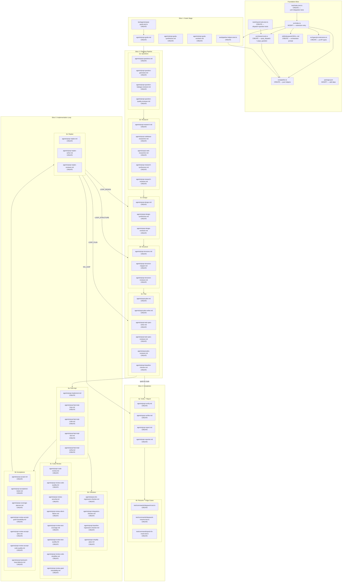

# Structure

## Project Layout

The project is a pi extension targeting Node.js with TypeScript (CommonJS, ES2020). Source files live in `src/` (one file currently: `src/index.ts`), tests in `test/` (one file currently: `test/index.test.js`), compiled output in `dist/`. No `agents/`, `skills/`, or `src/types/` directories exist yet — all must be created. The `.pipeline/` directory holds run artifacts from prior pipeline executions (excluded from the extension build). `package.json` defines `"main": "dist/index.js"` and uses `@types/node` + `typescript` as dev dependencies.

## File Map

### Foundation Slice: Extension Entry, Pipeline Helpers, Shared Tools, Orchestrator Skill

> **Architecture note**: The requirements directory structure lists `agents/deepwork.md` as the orchestrator agent type. This has been intentionally replaced by `skills/deepwork/SKILL.md`. In the pi architecture, the orchestrator runs as the **main pi agent** via an injected skill — not as a dispatched subagent. This is the key architectural adaptation noted in the design's Key Decisions table ("Orchestrator hosting: Main pi agent becomes orchestrator via injected skill"). The `agents/deepwork.md` file is therefore not created; its prompt content is adapted into `skills/deepwork/SKILL.md` with the adaptations documented in requirements.md (replace `task` → `Agent`, `question` → `qrspi_question`, simplify telemetry, remove permission system). Stage orchestrator subagents (e.g., `qrspi-goals.md`, `qrspi-implement.md`) remain in `agents/` as dispatched subagent types.

| File | Action | Purpose |
|------|--------|---------|
| `src/index.ts` | MODIFY | Replace starter code with extension factory function that registers `/deepwork` and `/deepwork-resume` commands, `qrspi_dispatch` and `qrspi_question` tools, and injects the `deepwork` skill via `resources_discover`. |
| `src/pipeline.ts` | CREATE | Pure helpers: run ID generation (`qrspi-YYYYMMDD-HHMMSS`), pipeline directory path construction, git branch naming, state file YAML templates, telemetry event templates. |
| `src/shared-tools.ts` | CREATE | `qrspi_dispatch` tool (accesses `Symbol.for("pi-subagents:manager")` for sub-subagent spawning via `AgentManager`) and `qrspi_question` tool (wraps `ctx.ui.confirm` / `ctx.ui.select`). |
| `src/types/pi-extensions.ts` | CREATE | TypeScript interface definitions for pi's `ExtensionAPI`, `ExtensionContext`, `ToolDefinition`, and `CommandDefinition` contracts. This file is the single adjustment point if the actual pi runtime exposes different shapes from the documented API. |
| `skills/deepwork/SKILL.md` | CREATE | Orchestrator prompt adapted from `/home/n3m6/.config/opencode/agents/deepwork.md` (~927 lines). Replaces `task` → `Agent`, `question` → `qrspi_question`, simplifies telemetry, removes permission system. This replaces `agents/deepwork.md` from the requirements — see architecture note above. |
| `package.json` | MODIFY | Add `@tintinweb/pi-subagents` as a peer dependency (optional), update description, add extension metadata fields. |
| `test/index.test.js` | DELETE | Replaced by `test/index.test.ts` (TypeScript source, compiles to `dist/test/index.test.js` for execution via `node --test`). |
| `test/index.test.ts` | CREATE | Unit tests for `generateRunId`, `getPipelineDir`, pipeline helpers; integration tests for command registration and tool schemas. |
| `test/shared-tools.test.ts` | CREATE | Unit tests for `qrspi_dispatch` graceful fallback and `qrspi_question` parameter validation. |

> *Justification: 9 files (including DELETE). The foundation slice is the minimal cohesive unit — all source files are interdependent (index imports pipeline + shared-tools + types; shared-tools uses pipeline types and types/pi-extensions; skill is consumed by index). Splitting would create artificial boundaries.*

#### Interfaces

```typescript
// src/index.ts — extension entry
import type { ExtensionAPI, ExtensionContext, ToolDefinition, CommandHandler } from "./types/pi-extensions";

export default function activate(pi: ExtensionAPI): void | Promise<void>;

// Command registration signatures
interface DeepworkCommandArgs { task: string; }
type DeepworkHandler = (args: DeepworkCommandArgs, ctx: ExtensionContext) => Promise<void>;

interface ResumeCommandArgs {
  "run-id": string;
  // Alias: resets to final stage for full replay
  reset?: boolean;
}
type ResumeHandler = (args: ResumeCommandArgs, ctx: ExtensionContext) => Promise<void>;
```

```typescript
// src/pipeline.ts — pipeline helpers

/** Generates a unique run ID: qrspi-YYYYMMDD-HHMMSS */
export function generateRunId(): string;

/** Returns the pipeline directory path for a given run: .pipeline/<runId> */
export function getPipelineDir(runId: string): string;

/** Returns git branch name: qrspi/<runId> */
export function getGitBranch(runId: string): string;

/** Returns the state.md path for a run */
export function getStatePath(runId: string): string;

/** Returns the telemetry directory path */
export function getTelemetryDir(runId: string): string;

/** Returns the events.jsonl path */
export function getEventsPath(runId: string): string;

/** Returns the run-log.md path */
export function getRunLogPath(runId: string): string;

/** Returns the metrics-summary.md path */
export function getMetricsPath(runId: string): string;

/** Template for initial state.md YAML frontmatter */
export interface PipelineState {
  run_id: string;
  route: "full" | "quick-fix" | "";
  current_phase: number;
  total_phases: number;
  last_completed_stage: string;
  next_stage: string;
  stages_completed: string[];
  phase_history: PhaseHistoryEntry[];
  backward_loops: number;
  resume_source: "fresh" | "resume";
}
export interface PhaseHistoryEntry {
  phase: number;
  completed_stages: string[];
}
export function makeInitialState(runId: string): PipelineState;

/** Telemetry event envelope */
export interface TelemetryEvent {
  schema_version: string;
  event_id: string;
  sequence: number;
  ts: string; // UTC ISO timestamp
  run_id: string;
  writer_agent: string;
  writer_scope: string;
  event_type: string;
  status: "PASS" | "FAIL" | "SKIP" | "ABORT";
  route: "full" | "quick-fix" | "";
  summary: string;
  stage?: number;
  stage_instance?: string;
  phase?: number;
  wave?: number;
  task_id?: string;
  review_round?: number;
  attempt?: number;
  child_agent?: string;
  correlation_id?: string;
  payload?: {
    context?: Record<string, unknown>;
    artifacts?: string[];
    timing?: { started_at: string; completed_at: string; duration_ms: number; };
    decision?: string;
    error?: string;
    git?: { branch: string; commit?: string; };
  };
}
export function makeTelemetryEvent(
  runId: string, eventType: string, overrides: Partial<TelemetryEvent>
): TelemetryEvent;

/** Stage names in execution order (0-indexed internal map) */
export const STAGE_NAMES: ReadonlyArray<string>;
export function stageNumber(name: string): number;
export function nextStage(currentStage: string, route: "full" | "quick-fix"): string | null;
```

```typescript
// src/shared-tools.ts — custom tools for stage orchestrators

/** Parameter types for qrspi_dispatch tool */
export interface QrspiDispatchParams {
  subagent_type: string;
  prompt: string;
  description: string;
  model?: string;
  thinking?: string;
  max_turns?: number;
  run_in_background?: boolean;
}

/** Parameter types for qrspi_question tool */
export interface QrspiQuestionParams {
  header: string;
  message: string;
  options: string[];
  type: "confirm" | "select";
}

/** Pi tool definition for qrspi_dispatch */
export function createDispatchTool(): ToolDefinition;

/** Pi tool definition for qrspi_question */
export function createQuestionTool(): ToolDefinition;

/** Result from sub-subagent dispatch */
export interface DispatchResult {
  agentId: string;
  status: "completed" | "running" | "failed";
  result?: string;
  error?: string;
  toolUses?: number;
  startedAt: string;
  completedAt?: string;
}

/** AgentManager interface (accessed via Symbol.for("pi-subagents:manager")) */
export interface AgentManagerFacade {
  spawn(pi: unknown, ctx: unknown, type: string, prompt: string, options: Record<string, unknown>): string;
  spawnAndWait(pi: unknown, ctx: unknown, type: string, prompt: string, options: Record<string, unknown>): Promise<DispatchResult>;
  waitForAll(): Promise<void>;
  hasRunning(): boolean;
  getRecord(id: string): DispatchResult | undefined;
}
```

```typescript
// src/types/pi-extensions.ts — pi extension API types (assumed from pi runtime)
// These types reflect pi's documented extension contract.

export interface ExtensionAPI {
  registerCommand(name: string, definition: CommandDefinition): void;
  registerTool(definition: ToolDefinition): void;
  on(event: "resources_discover" | "session_shutdown" | string, handler: (...args: any[]) => any): void;
}

export interface CommandDefinition {
  description: string;
  getArgumentCompletions?: () => Promise<Record<string, string[]>>;
  handler: CommandHandler;
}

export type CommandHandler = (args: Record<string, any>, ctx: ExtensionContext) => Promise<void>;

export interface ToolDefinition {
  name: string;
  label: string;
  description: string;
  parameters: Record<string, unknown>; // TypeBox-compatible schema
  execute(
    toolCallId: string,
    params: Record<string, unknown>,
    signal: AbortSignal,
    onUpdate: (update: { content: string }) => void,
    ctx: ExtensionContext
  ): Promise<{ content: string; details?: Record<string, unknown> }>;
}

export interface ExtensionContext {
  ui: {
    confirm(title: string, message: string, opts?: { timeout?: number; signal?: AbortSignal }): Promise<boolean>;
    select(title: string, options: string[], opts?: { timeout?: number; signal?: AbortSignal }): Promise<string | undefined>;
  };
  hasUI: boolean;
  cwd: string;
  sessionManager: unknown;
  modelRegistry: unknown;
  model: string;
  signal: AbortSignal;
  abort(): void;
  shutdown(): void;
}
```

---

### Slice 1: Goals Stage (Stage 1 Orchestrator + Leaf Agents)

| File | Action | Purpose |
|------|--------|---------|
| `agents/qrspi-goals.md` | CREATE | Stage 1 orchestrator: captures user intent via interactive dialogue, dispatches `qrspi-goals-synthesizer` and `qrspi-goals-reviewer`, runs human gate. Writes `requirements.md`, `goals.md`, `config.md`. Determines `full` vs `quick-fix` route. |
| `agents/qrspi-goals-synthesizer.md` | CREATE | Synthesizes `goals.md` and `config.md` from interview context. Read-only input processing. |
| `agents/qrspi-goals-reviewer.md` | CREATE | Reviews goals for clarity, fidelity, scope, testability, and traceability. Read-only; returns PASS/FAIL with fix guidance. |

> *5 files total (including the two test files below).*

| `test/agents/qrspi-goals.test.ts` | CREATE | Verifies goals orchestrator prompt validates required input headers, return contract format (`### Status`, `### Route`, `### Files Written`, `### Summary`), and frontmatter shape. |
| `test/pipeline-helpers.test.ts` | CREATE | Unit tests for `generateRunId` format, `getPipelineDir`, `getGitBranch`, `getStatePath`, `makeInitialState`, stage sequencing (`nextStage`). |

#### Interfaces

```typescript
// Agent type frontmatter contract (all agent .md files follow this schema)
interface AgentFrontmatter {
  description: string;
  tools: string;            // comma-separated: "read, bash, grep, find, ls" or "all"
  model?: string;           // e.g. "anthropic/claude-haiku-4-5"
  thinking?: "low" | "medium" | "high";
  max_turns: number;
  prompt_mode?: "replace" | "append";
  extensions?: boolean | string;
  disallowed_tools?: string;
  inherit_context?: boolean;
  run_in_background?: boolean;
  isolated?: boolean;
  enabled?: boolean;
}
```

---

### Slice 2a: Questions Stage (Stage 2)

| File | Action | Purpose |
|------|--------|---------|
| `agents/qrspi-questions.md` | CREATE | Stage 2 orchestrator: reads `goals.md` + `requirements.md`, dispatches `qrspi-question-generator`, `qrspi-question-leakage-reviewer`, `qrspi-question-quality-reviewer`. Writes `goal-inventory.md`, `questions.md`, and review files. |
| `agents/qrspi-question-generator.md` | CREATE | Generates research questions from goal inventory. Produces structured question table. |
| `agents/qrspi-question-leakage-reviewer.md` | CREATE | Reviews questions for goal leakage (questions that assume answers). Read-only. |
| `agents/qrspi-question-quality-reviewer.md` | CREATE | Reviews questions for coverage quality and answerability. Read-only. |

---

### Slice 2b: Research Stage (Stage 3)

| File | Action | Purpose |
|------|--------|---------|
| `agents/qrspi-research.md` | CREATE | Stage 3 orchestrator: reads `questions.md`, dispatches `qrspi-codebase-researcher`, `qrspi-web-researcher`, `qrspi-research-synthesizer`, `qrspi-research-reviewer`. Enforces goal-blind constraint on child agents. Writes `research/q-NN.md` and `research/summary.md`. |
| `agents/qrspi-codebase-researcher.md` | CREATE | Investigates repository for facts relevant to a single research question. Goal-blind. |
| `agents/qrspi-web-researcher.md` | CREATE | Searches web for facts relevant to a single research question. Goal-blind. |
| `agents/qrspi-research-synthesizer.md` | CREATE | Synthesizes per-question findings into a unified research summary. |
| `agents/qrspi-research-reviewer.md` | CREATE | Reviews research summary for completeness, accuracy, and goal-blind compliance. Read-only. |

---

### Slice 2c: Design Stage (Stage 4)

| File | Action | Purpose |
|------|--------|---------|
| `agents/qrspi-design.md` | CREATE | Stage 4 orchestrator: reads `research/summary.md` + `goals.md`, dispatches `qrspi-design-synthesizer` and `qrspi-design-reviewer`, runs human gate. Writes `design.md`. |
| `agents/qrspi-design-synthesizer.md` | CREATE | Produces `design.md` from goals and research. Outputs architectural patterns, vertical slices, system diagram. |
| `agents/qrspi-design-reviewer.md` | CREATE | Reviews design for coherence, traceability to goals, and research coverage. Read-only. |

---

### Slice 2d: Structure Stage (Stage 5)

| File | Action | Purpose |
|------|--------|---------|
| `agents/qrspi-structure.md` | CREATE | Stage 5 orchestrator: reads `design.md`, dispatches `qrspi-structure-mapper` and `qrspi-structure-reviewer`, runs human gate. Writes `structure.md`. |
| `agents/qrspi-structure-mapper.md` | CREATE | Maps design slices to concrete files, typed interfaces, and produces Mermaid diagram. Read-only project inspection. |
| `agents/qrspi-structure-reviewer.md` | CREATE | Reviews structure map for completeness and design fidelity. Read-only. |

---

### Slice 2e: Plan Stage (Stage 6)

| File | Action | Purpose |
|------|--------|---------|
| `agents/qrspi-plan.md` | CREATE | Stage 6 orchestrator: reads `structure.md`, dispatches `qrspi-plan-writer`, `qrspi-task-spec-writer`, `qrspi-task-spec-reviewer`, `qrspi-plan-reviewer`, `qrspi-baseline-checker`. Handles phase breakdown, unclean-cap escalation gates. Writes `plan.md`, `phase-manifest.md`, task specs, baseline. |
| `agents/qrspi-plan-writer.md` | CREATE | Writes implementation plan from structure map. Produces phase breakdown and task ordering. |
| `agents/qrspi-task-spec-writer.md` | CREATE | Writes per-task canonical spec files. Edit: allow (mutates task spec outlines). |
| `agents/qrspi-task-spec-reviewer.md` | CREATE | Reviews task specs for clarity, scope, and testability. Edit: allow (may fix specs). |
| `agents/qrspi-plan-reviewer.md` | CREATE | Reviews plan for completeness, phase ordering, and risk coverage. Read-only. |
| `agents/qrspi-baseline-checker.md` | CREATE | Captures pre-implementation baseline (existing tests, lint, build) for regression detection. Read-only. |

> *Justification: 6 agent files form a single stage's orchestration unit. The plan orchestrator dispatches all 5 leaf agents in a defined sequence with review loops; splitting across slices would fracture the dispatch contract and unclean-cap escalation logic.*

---

### Slice 3a: Fast Implementation Loop (Stage 7 Core)

| File | Action | Purpose |
|------|--------|---------|
| `agents/qrspi-implement.md` | CREATE | Stage 7 orchestrator: reads `plan.md` + `phase-manifest.md` + task specs, dispatches `qrspi-fast-impl-loop` per task, then checkers after wave completion, then `qrspi-simplify-pass`. Manages git worktrees per task. Handles verify-fix mode for Stage 9 auto-fix. |
| `agents/qrspi-fast-impl-loop.md` | CREATE | Per-task code-first loop agent. Sequences `qrspi-fast-impl-code` → `qrspi-fast-impl-test` → `qrspi-fast-impl-verify`. Enforces 11 invariants (ONE TASK ONLY, MAX 8 OUTER CYCLES, STALL DETECTION). Routes post-verify failures via Route Hint. |
| `agents/qrspi-fast-impl-code.md` | CREATE | Writes implementation code for a single task. Iteration budget: fresh=3, code-repair=2, simplify=2. Edit: allow. |
| `agents/qrspi-fast-impl-test.md` | CREATE | Writes tests for implemented code. Classifies evidence: DETERMINISTIC, FLAKY, HARNESS_NOISY, AMBIGUOUS, REDUNDANT. Edit: allow. |
| `agents/qrspi-fast-impl-verify.md` | CREATE | Verifies implementation passes tests and meets task spec. Returns Route Hints: PASS, CODE_REPAIR, TEST_REPAIR, CODE_AND_TEST_REPAIR, BACKWARD_LOOP. |

---

### Slice 3b: Stage 7 Checkers & Simplifier

| File | Action | Purpose |
|------|--------|---------|
| `agents/qrspi-e2e-regression-checker.md` | CREATE | Runs end-to-end regression suite against baseline. Read-only. |
| `agents/qrspi-integration-checker.md` | CREATE | Runs integration tests post-wave. Read-only. |
| `agents/qrspi-baseline-regression-checker.md` | CREATE | Compares current state against pre-implementation baseline. Read-only. |
| `agents/qrspi-simplify-pass.md` | CREATE | Post-wave simplification pass: removes dead code, consolidates duplication, improves readability. Edit: allow. |

---

### Slice 3c: Code Review System

| File | Action | Purpose |
|------|--------|---------|
| `agents/qrspi-code-review.md` | CREATE | Code review orchestrator: dispatches review lenses in parallel, synthesizes findings. |
| `agents/qrspi-review-code-quality.md` | CREATE | Code quality review lens. Read-only. |
| `agents/qrspi-review-security.md` | CREATE | Security review lens. Read-only. |
| `agents/qrspi-review-silent-failure.md` | CREATE | Silent failure / error handling review lens. Read-only. |
| `agents/qrspi-review-test-coverage.md` | CREATE | Test coverage review lens. Read-only. |
| `agents/qrspi-review-test-quality.md` | CREATE | Test quality review lens. Read-only. |
| `agents/qrspi-review-code-simplifier.md` | CREATE | Code simplification review lens. Read-only. |
| `agents/qrspi-review-goal-traceability.md` | CREATE | Goal traceability review lens. Read-only. |

> *Justification: The 8 code-review agents form a single dispatch unit — the orchestrator fans out to all 7 lenses in parallel, then synthesizes a unified report. They share the same return contract and are only ever dispatched together.*

---

### Slice 3d: Acceptance Testing Stage (Stage 8)

| File | Action | Purpose |
|------|--------|---------|
| `agents/qrspi-accept.md` | CREATE | Stage 8 orchestrator: dispatches `qrspi-acceptance-tester`, `qrspi-coverage-planner`, three accept-reviewers, `qrspi-backward-loop-detector`. Runs max 3 rounds, 3 plan-review cycles/round, 2 repair attempts/round. Writes acceptance results and backward-loop analysis. |
| `agents/qrspi-acceptance-tester.md` | CREATE | Executes acceptance tests. Max 3 rounds, 3 plan-review cycles/round, 2 repair attempts/round. Edit: allow (may repair tests). |
| `agents/qrspi-coverage-planner.md` | CREATE | Plans test coverage strategy for acceptance phase. |
| `agents/qrspi-review-accept-goal-traceability.md` | CREATE | Reviews acceptance results for goal traceability. Read-only. |
| `agents/qrspi-review-accept-spec.md` | CREATE | Reviews acceptance results against task specs. Read-only. |
| `agents/qrspi-review-accept-code-quality.md` | CREATE | Reviews acceptance-phase code quality. Read-only. |
| `agents/qrspi-backward-loop-detector.md` | CREATE | Classifies acceptance failures into 6 categories with priority ordering: LOOP_GOALS → LOOP_DESIGN → LOOP_STRUCTURE → DEFER_REPLAN → NO_LOOP → LOOP_PLAN. Read-only. |

> *Justification: All 7 agents form the Stage 8 acceptance gate — the orchestrator runs them in a defined sequence with repair/retry loops. They share the same phase directory and pipeline artifacts. Splitting would fracture the repair-loop protocol and backward-loop detection logic.*

---

### Slice 3e: Replan Stage (Stage 8.5)

| File | Action | Purpose |
|------|--------|---------|
| `agents/qrspi-replan.md` | CREATE | Stage 8.5 orchestrator: reads backward-loop analysis, dispatches `qrspi-replan-writer` and `qrspi-replan-reviewer`. Handles unclean-cap escalation gates. |
| `agents/qrspi-replan-writer.md` | CREATE | Writes replan document from backward-loop findings. Edit: allow. |
| `agents/qrspi-replan-reviewer.md` | CREATE | Reviews replan for feasibility and completeness. Read-only. |

---

### Slice 4a: Verify & Report Stages (Stages 9–10)

| File | Action | Purpose |
|------|--------|---------|
| `agents/qrspi-verify.md` | CREATE | Stage 9 orchestrator: dispatches `qrspi-verifier`. On FAIL, re-dispatches `qrspi-implement` in verify-fix mode; second FAIL invokes backward-loop protocol. |
| `agents/qrspi-verifier.md` | CREATE | Executes final verification against goals, requirements, and acceptance criteria. Edit: allow. |
| `agents/qrspi-report.md` | CREATE | Stage 10 orchestrator: dispatches `qrspi-reporter`, presents `### Report Content` verbatim. Generates `metrics-summary.md`. |
| `agents/qrspi-reporter.md` | CREATE | Produces final report summarizing pipeline execution, artifacts, and outcomes. |

---

### Slice 4b: Resume, Quick-Fix Route, and Edge Cases

| File | Action | Purpose |
|------|--------|---------|
| `src/index.ts` | MODIFY | Add `/deepwork-resume` handler: read `state.md`, validate run ID, inject deepwork skill, emit resume message. Add quick-fix route decision logic in pre-flight flow. Add graceful fallback when `@tintinweb/pi-subagents` is not installed. Add git-availability check (warn + continue if `git` not in `$PATH`). |
| `test/commands/deepwork.test.ts` | CREATE | End-to-end tests for `/deepwork` command: validates run ID generation, directory creation, state file writing, git branch creation, skill injection. Mocked pi-subagents. |
| `test/commands/deepwork-resume.test.ts` | CREATE | Tests for `/deepwork-resume`: valid run ID resume, missing run ID error, corrupted state.md recovery. |
| `test/commands/quick-fix-route.test.ts` | CREATE | Tests that quick-fix route correctly skips Stages 4, 5, and Replan. Verifies route locking after Stage 6. |

#### Interfaces

```typescript
// Additional interfaces in src/index.ts for resume and error handling

/** Result of pre-flight validation */
export interface PreflightResult {
  ok: boolean;
  runId: string;
  error?: string;
}

/** Validates the user task and generates a run ID */
export function preflightTask(task: string, cwd: string): PreflightResult;

/** Creates the pipeline directory tree for a new run */
export function setupPipelineDirs(runId: string, cwd: string): string[];

/** Reads and validates state.md for resume */
export function readPipelineState(runId: string, cwd: string): PipelineState | null;

/** Checks if git is available on PATH */
export function isGitAvailable(): boolean;

/** Creates git branch qrspi/<runId> from main, returns true on success */
export function createGitBranch(runId: string, cwd: string): boolean;
```

---

## Cross-Slice Dependencies

### Named Shared Modules

| Module | Imported By | Exports |
|--------|-------------|---------|
| `src/pipeline.ts` | `src/index.ts`, `src/shared-tools.ts` | `generateRunId`, `getPipelineDir`, `getGitBranch`, `getStatePath`, `getTelemetryDir`, `getEventsPath`, `getRunLogPath`, `getMetricsPath`, `makeInitialState`, `makeTelemetryEvent`, `STAGE_NAMES`, `stageNumber`, `nextStage`, `PipelineState`, `TelemetryEvent` |
| `src/shared-tools.ts` | `src/index.ts` (tool registration) | `createDispatchTool`, `createQuestionTool`, `QrspiDispatchParams`, `QrspiQuestionParams`, `DispatchResult` |
| `src/types/pi-extensions.ts` | `src/index.ts`, `src/shared-tools.ts` | `ExtensionAPI`, `ExtensionContext`, `CommandDefinition`, `ToolDefinition` |
| `skills/deepwork/SKILL.md` | Loaded by pi runtime via `resources_discover` | orchestrator system prompt (consumed by main agent as injected skill) |
| `agents/qrspi-*.md` | pi-subagents `Agent` tool | agent type definitions (consumed by subagent dispatch) |

### Data-Flow Relationships Between Slices

1. **Foundation → All Slices**: `src/index.ts` registers commands and tools consumed by every pipeline stage. `src/pipeline.ts` type definitions (`PipelineState`, `TelemetryEvent`) are the canonical data shapes used by all orchestrator agents when reading/writing `state.md` and `events.jsonl`. `qrspi_dispatch` is the sole mechanism for stage orchestrators to spawn leaf subagents.

2. **Slice 1 → Slice 2a**: `requirements.md` and `goals.md` (written by Stage 1) are mandatory inputs to the Questions stage orchestrator (`qrspi-questions.md` reads them to generate questions).

3. **Slice 2a → Slice 2b**: `questions.md` (written by Stage 2) is the input artifact listing all research questions for Stage 3.

4. **Slice 2b → Slice 2c**: `research/summary.md` (written by Stage 3) is the primary input to the Design stage.

5. **Slice 2c → Slice 2d**: `design.md` (written by Stage 4) drives the Structure stage's file mapping.

6. **Slice 2d → Slice 2e**: `structure.md` (written by Stage 5) provides file-level mapping that the Plan stage breaks into tasks.

7. **Slice 2e → Slice 3a**: `plan.md`, `phase-manifest.md`, and task specs (`tasks/task-NN.md`) are the implementation blueprint consumed by the Implement stage.

8. **Slice 3a → Slice 3b**: Post-wave artifacts trigger checker execution; `qrspi-implement` dispatches `qrspi-e2e-regression-checker`, `qrspi-integration-checker`, `qrspi-baseline-regression-checker`, and `qrspi-simplify-pass` after each wave.

9. **Slice 3a/3b → Slice 3c**: Completed implementation code is the review target for `qrspi-code-review` and its lenses. The code-review orchestrator is dispatched by `qrspi-implement`.

10. **Slice 3a/3b/3c → Slice 3d**: Phase implementation artifacts feed into `qrspi-accept`, which runs acceptance testing against the phase deliverables. Backward-loop detection reads acceptance results.

11. **Slice 3d → Slice 3e**: `backward-loop-analysis.md` (written by `qrspi-backward-loop-detector`) triggers the Replan stage when a backward loop is detected.

12. **Slice 3e → Slice 2c/2d/2e**: Replan may loop back to Design, Structure, or Plan stages depending on the loop classification.

13. **Slice 3d/3e → Slice 4a**: After all phases pass acceptance (no backward loop), the pipeline proceeds to Verify and Report.

14. **Slice 4b → All Slices**: `/deepwork-resume` reads `state.md` to restart the pipeline at any stage boundary. Quick-fix route skips Slice 2c, 2d, 3e entirely.

---

## Architectural Diagram



---

## Convention Notes

1. **New directories required**: `agents/`, `skills/deepwork/`, `src/types/`, `test/commands/`, `test/agents/`. The `agents/` and `skills/` directories do not currently exist and must be created. The existing `test/` directory currently contains only `index.test.js` — this file is deleted and replaced by `test/index.test.ts`.

2. **`agents/deepwork.md` consolidation**: The requirements directory structure lists `agents/deepwork.md` as the orchestrator agent type. In the pi architecture, the orchestrator runs as the **main pi agent** via an injected skill (`skills/deepwork/SKILL.md`) — not as a dispatched subagent. This architectural decision is captured in the design's Key Decisions table under "Orchestrator hosting." The prompt content from the original opencode `deepwork.md` (~927 lines) is adapted into `skills/deepwork/SKILL.md` with the documented conversions (replace `task` → `Agent`, `question` → `qrspi_question`, simplify telemetry, remove permission system). No standalone `agents/deepwork.md` file is created.

3. **Agent type discovery**: The 55 agent `.md` files go in `agents/` at the project root. For pi-subagents to discover them, users must symlink or copy `agents/` into `~/.pi/agent/agents/qrspi/` (global) or place them in `.pi/agents/` (project-local). The extension's `README.md` should document both paths.

4. **Skill discovery**: `skills/deepwork/SKILL.md` follows the pi directory-skill convention (`<root>/.../<name>/SKILL.md`). The `resources_discover` event handler in `src/index.ts` returns `{ skillPaths: [path.join(__dirname, "..", "skills")] }` so pi's skill loader discovers it.

5. **pi extension API types**: The `src/types/pi-extensions.ts` file defines TypeScript interfaces for pi's extension API. These are assumptions based on the pi extension documentation cited in requirements.md. If the actual pi runtime exposes different shapes, this file is the single adjustment point.

6. **CommonJS module pattern**: All TypeScript source compiles to CommonJS (per `tsconfig.json` `"module": "commonjs"`). Export shapes use `export default function activate(...)` for the extension factory and named `export function/interface` for everything else. Tests use `require()` and `node:test` / `node:assert/strict` (consistent with existing `test/index.test.js`).

7. **`dist/` in `.gitignore`**: The existing `.gitignore` already includes `dist` (line 83). The compiled output is excluded from version control.

8. **`@tintinweb/pi-subagents` dependency**: Listed as `peerDependencies` (optional) in `package.json` since the extension gracefully degrades when it is absent. The `qrspi_dispatch` tool returns a clear error message if `Symbol.for("pi-subagents:manager")` evaluates to `undefined`.

9. **Git availability uncertainty**: The `isGitAvailable()` check uses `which git` or `command -v git`. If the pi runtime environment does not have `git` in `$PATH`, git branching is skipped with `console.warn(...)` and the pipeline continues using only `.pipeline/` file state — no error is thrown.

10. **Test file naming**: Tests use `.test.ts` extension (TypeScript source), which compiles to `.test.js` for execution via `node --test`. The `npm test` script in `package.json` should be updated to `"npm run build && node --test ./test/**/*.test.js"` (already present).

11. **Uncertainty — pi ExtensionContext exact shape**: The `ExtensionContext` and `ExtensionAPI` interfaces in `src/types/pi-extensions.ts` are based on documented pi behavior but may differ in the actual runtime. These are marked as assumptions; the file is the single place to adjust if pi's API diverges.

12. **`test/index.test.js` disposal**: The existing `test/index.test.js` is deleted. It tests the starter `getReadyMessage()` function that is replaced by the extension factory `activate()`. The replacement `test/index.test.ts` covers `generateRunId`, `getPipelineDir`, command registration, and tool schemas — the new functionality introduced by the Foundation slice.
